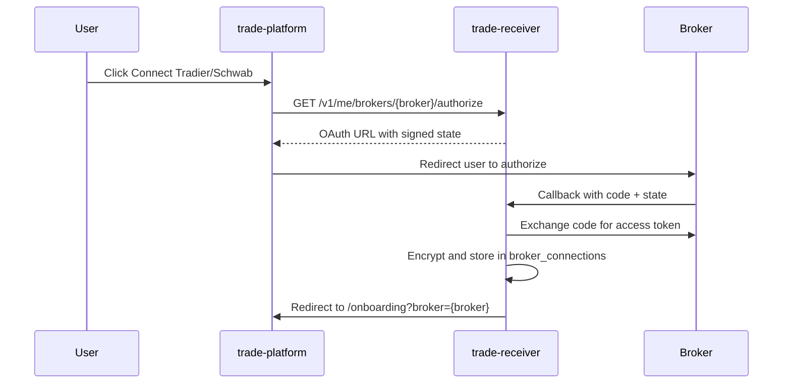

# Trade Receiver

FastAPI webhook receiver with AI trade parsing, Lemon Squeezy subscription gating, and multi-broker execution.

## Quick start

```bash
cd trade-receiver
pip install -e ".[dev]"
uvicorn app.main:app --reload
```

Database defaults to `sqlite+libsql:///./data/trade.db`.

## Deploy on Coolify

Coolify/Nixpacks reads `pyproject.toml` and may try `python -m trade-receiver`, which fails (hyphens are invalid in Python module names). This repo ships explicit start config instead.

**Recommended:** use the included **Dockerfile** (Build Pack → **Dockerfile**, not Nixpacks).

| Setting | Value |
|---------|--------|
| Build Pack | **Dockerfile** (faster, more reliable) or Nixpacks (uses `nixpacks.toml`) |
| Port | `8000` (or match `PORT` env) |
| Start command | leave empty |

**Nixpacks build:** `nixpacks.toml` sets the start command to `uvicorn app.main:app --host 0.0.0.0 --port $PORT`.

Set `PORT=8000` in Coolify environment variables. Mount a persistent volume on `/app/data` for the SQLite/libSQL database.

## Environment

Copy `.env.example` to `.env`. Variables fall into three groups:

### Server secrets (required in production)

| Variable | Purpose |
|----------|---------|
| `DATABASE_URL` | libSQL/SQLite connection |
| `API_SECRET_KEY` | Signs OAuth state tokens |
| `ENCRYPTION_KEY` | Encrypts per-user broker tokens at rest |
| `RECEIVER_BASE_URL` | Public API URL (webhook links) |
| `PLATFORM_BASE_URL` | Where OAuth redirects after connect (e.g. `http://localhost:3000`) |
| `LEMON_SQUEEZY_WEBHOOK_SECRET` | Subscription webhook verification |
| `BETTER_AUTH_URL` | Public platform URL — JWT issuer/JWKS for API auth |
| `INTERNAL_API_SECRET` | Shared secret for user provisioning from platform signup |

### OAuth app registration (your developer apps — not user accounts)

Users connect brokers via the platform **Connections** page. These env vars register *your* app with each broker:

| Variable | Broker |
|----------|--------|
| `SCHWAB_CLIENT_ID`, `SCHWAB_CLIENT_SECRET`, `SCHWAB_REDIRECT_URI` | Schwab OAuth app |
| `TRADIER_CLIENT_ID`, `TRADIER_CLIENT_SECRET`, `TRADIER_REDIRECT_URI` | Tradier OAuth app |
| `TRADIER_API_BASE` | Sandbox vs live API host |

Per-user access tokens and account IDs are stored encrypted in `broker_connections` — never in `.env`.

### Optional

| Variable | Purpose |
|----------|---------|
| `OPENAI_API_KEY` | LLM alert parsing (falls back to rules if unset) |
| `TURSO_AUTH_TOKEN` | Remote libSQL auth |
| `WEBULL_ENABLED` | Feature flag for Webull adapter |

## Broker connect flow



## API

- `POST /v1/internal/provision` — create/link user from Better Auth signup (internal secret)
- `GET /v1/me` — current user (Better Auth JWT or API key)
- `GET /v1/me/billing` — subscription status
- `GET /v1/me/brokers/tradier/authorize` — start Tradier OAuth
- `GET /v1/me/brokers/schwab/authorize` — start Schwab OAuth
- `GET /v1/reviews` — public customer reviews (newest first)
- `GET /v1/me/review` — current user's review (auth)
- `POST /v1/me/reviews` — create or update review (active subscription required)
- `DELETE /v1/me/reviews` — remove own review (active subscription required)
- `GET /v1/me/settings` — trading prefs including sizing mode
- `PUT /v1/me/settings` — update paper/live, sizing, caps, tickers
- `POST /v1/me/onboarding/complete` — mark onboarding finished
- `POST /v1/me/brokers/{broker}/test-order` — place 1-share SPY test order (follows default_mode)
- `POST /hooks/{user_id}/{secret}` — notification webhook

## Trade sizing

Users choose a sizing mode in settings or onboarding:

| Mode | Behavior |
|------|----------|
| `alert_inferred` | Use contract count from alert text (AI or rules), capped by `max_contracts` |
| `fixed` | Always trade `fixed_contracts` per alert |
| `risk_percent` | Size from account equity × `risk_percent` ÷ option cost, capped by `max_contracts` |

Sizing runs after option chain validation in the webhook pipeline.

## Migrations

Schema migrations run **automatically on app startup** (Alembic `upgrade head`). No manual step is required for deploy or local dev.

To create a new migration after model changes:

```bash
alembic revision --autogenerate -m "describe change"
```

## Tests

```bash
DATABASE_URL=sqlite:///./data/test.db pytest
```

## Related repos

- [discord-trader](https://github.com/fcpauldiaz/discord-trader) — TanStack Start UI
- [notification-watcher](https://github.com/fcpauldiaz/discord-data-scraper) — macOS/Windows webhook sender
