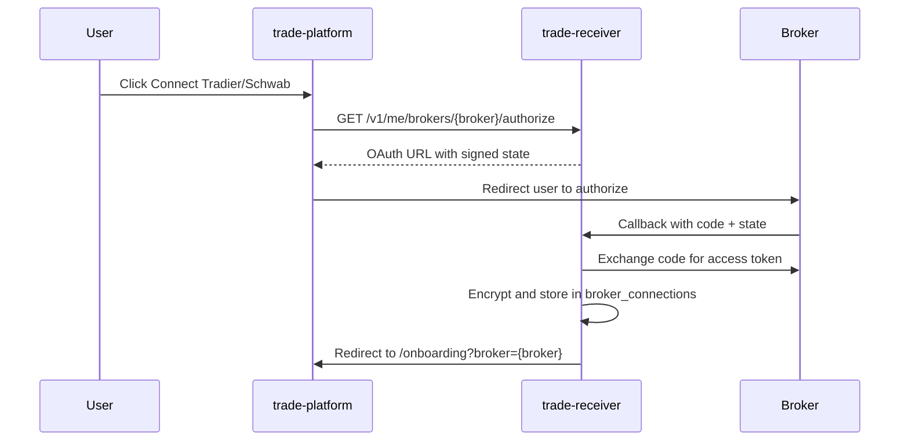

# Trade Receiver

FastAPI alert ingest service with AI trade parsing, Lemon Squeezy subscription gating, and multi-broker execution.

## Quick start

```bash
cd trade-receiver
pip install -e ".[dev]"
uvicorn app.main:app --reload
```

Database defaults to `sqlite:///./data/trade.db` for local dev. For **Turso**, set:

```bash
DATABASE_URL=libsql://your-db-name-org.turso.io
TURSO_AUTH_TOKEN=your-token
```

The app converts `libsql://` to SQLAlchemy's `sqlite+libsql://` form automatically.

## Deploy on Coolify (Dockerfile)

Use the repo **Dockerfile** — do not use Nixpacks.

| Setting | Value |
|---------|--------|
| Build Pack | **Dockerfile** |
| Dockerfile location | `/Dockerfile` |
| Port | `8000` |
| Start command | leave empty (uses image `CMD`) |

Set production env vars (see `.env.example`). For Turso:

| Variable | Example |
|----------|---------|
| `DATABASE_URL` | `libsql://your-db-org.turso.io` |
| `TURSO_AUTH_TOKEN` | token from `turso db tokens create` |

No `/app/data` volume is required for remote Turso.

```bash
docker build -t trade-receiver .
docker run --rm -p 8000:8000 -e PORT=8000 -v trade-receiver-data:/app/data trade-receiver
```

## Environment

Copy `.env.example` to `.env`. Variables fall into three groups:

### Server secrets (required in production)

| Variable | Purpose |
|----------|---------|
| `DATABASE_URL` | libSQL/SQLite connection (shared with trade-platform auth tables) |
| `API_SECRET_KEY` | Signs OAuth state tokens |
| `ENCRYPTION_KEY` | Encrypts per-user broker tokens at rest |
| `RECEIVER_BASE_URL` | Public API URL (ingest + OAuth callbacks) |
| `PLATFORM_BASE_URL` | Where OAuth redirects after connect (e.g. `http://localhost:3000`) |
| `LEMON_SQUEEZY_WEBHOOK_SECRET` | Subscription webhook verification |
| `BETTER_AUTH_URL` | Public platform URL — JWT issuer/JWKS for API auth |
| `INTERNAL_API_SECRET` | Shared secret for user provisioning from platform signup |

### OAuth app registration (your developer apps — not user accounts)

Users connect brokers via the platform **Connections** page. These env vars register *your* app with each broker:

| Variable | Broker |
|----------|--------|
| `SCHWAB_CLIENT_ID`, `SCHWAB_CLIENT_SECRET`, `SCHWAB_REDIRECT_URI` | Schwab OAuth app |
| `TRADIER_CLIENT_ID`, `TRADIER_CLIENT_SECRET`, `TRADIER_REDIRECT_URI` | Tradier OAuth app |
| `TRADIER_API_BASE` | Sandbox vs live API host |

Per-user access tokens and account IDs are stored encrypted in `broker_connections` — never in `.env`.

### Optional

| Variable | Purpose |
|----------|---------|
| `OPENAI_API_KEY` | LLM alert parsing (falls back to rules if unset) |
| `TURSO_AUTH_TOKEN` | Remote libSQL auth (same value on trade-platform) |
| `WEBULL_ENABLED` | Feature flag for Webull adapter |

## Broker connect flow



## API

- `POST /v1/internal/provision` — create/link user from Better Auth signup (internal secret)
- `POST /v1/internal/device-token` — issue desktop API key (internal secret)
- `GET /v1/me` — current user (Better Auth JWT or API key)
- `GET /v1/me/billing` — subscription status
- `GET /v1/me/brokers/tradier/authorize` — start Tradier OAuth
- `GET /v1/me/brokers/schwab/authorize` — start Schwab OAuth
- `GET /v1/reviews` — public customer reviews (newest first)
- `GET /v1/me/review` — current user's review (auth)
- `POST /v1/me/reviews` — create or update review (active subscription required)
- `DELETE /v1/me/reviews` — remove own review (active subscription required)
- `GET /v1/me/settings` — trading prefs including sizing mode
- `PUT /v1/me/settings` — update paper/live, sizing, caps, tickers
- `POST /v1/me/onboarding/complete` — mark onboarding finished
- `POST /v1/me/brokers/{broker}/test-order` — place 1-share SPY test order (follows default_mode)
- `POST /v1/ingest` — authenticated alert ingest (desktop app Bearer token)

## Trade sizing

Users choose a sizing mode in settings or onboarding:

| Mode | Behavior |
|------|----------|
| `alert_inferred` | Use contract count from alert text (AI or rules), capped by `max_contracts` |
| `fixed` | Always trade `fixed_contracts` per alert |
| `risk_percent` | Size from account equity × `risk_percent` ÷ option cost, capped by `max_contracts` |

Sizing runs after option chain validation in the ingest pipeline.

## Migrations

Schema migrations run **automatically on app startup** (Alembic `upgrade head`). No manual step is required for deploy or local dev.

To create a new migration after model changes:

```bash
alembic revision --autogenerate -m "describe change"
```

## Tests

```bash
DATABASE_URL=sqlite:///./data/test.db pytest
```

## Related repos

- [discord-trader](https://github.com/fcpauldiaz/discord-trader) — TanStack Start UI
- [notification-watcher](https://github.com/fcpauldiaz/discord-data-scraper) — macOS/Windows desktop alert forwarder
