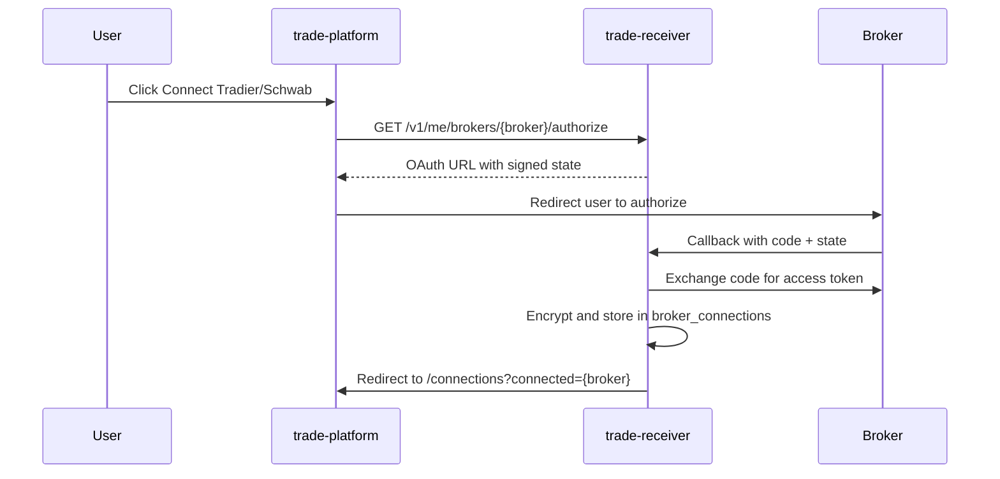

# Trade Receiver

FastAPI webhook receiver with AI trade parsing, Lemon Squeezy subscription gating, and multi-broker execution.

## Quick start

```bash
cd trade-receiver
pip install -e ".[dev]"
uvicorn app.main:app --reload
```

Database defaults to `sqlite+libsql:///./data/trade.db`.

## Environment

Copy `.env.example` to `.env`. Variables fall into three groups:

### Server secrets (required in production)

| Variable | Purpose |
|----------|---------|
| `DATABASE_URL` | libSQL/SQLite connection |
| `API_SECRET_KEY` | Signs OAuth state tokens |
| `ENCRYPTION_KEY` | Encrypts per-user broker tokens at rest |
| `RECEIVER_BASE_URL` | Public API URL (webhook links) |
| `PLATFORM_BASE_URL` | Where OAuth redirects after connect (e.g. `http://localhost:3000`) |
| `LEMON_SQUEEZY_WEBHOOK_SECRET` | Subscription webhook verification |

### OAuth app registration (your developer apps — not user accounts)

Users connect brokers via the platform **Connections** page. These env vars register *your* app with each broker:

| Variable | Broker |
|----------|--------|
| `SCHWAB_CLIENT_ID`, `SCHWAB_CLIENT_SECRET`, `SCHWAB_REDIRECT_URI` | Schwab OAuth app |
| `TRADIER_CLIENT_ID`, `TRADIER_CLIENT_SECRET`, `TRADIER_REDIRECT_URI` | Tradier OAuth app |
| `TRADIER_API_BASE` | Sandbox vs live API host |

Per-user access tokens and account IDs are stored encrypted in `broker_connections` — never in `.env`.

### Optional

| Variable | Purpose |
|----------|---------|
| `OPENAI_API_KEY` | LLM alert parsing (falls back to rules if unset) |
| `TURSO_AUTH_TOKEN` | Remote libSQL auth |
| `WEBULL_ENABLED` | Feature flag for Webull adapter |

## Broker connect flow



## API

- `POST /v1/users` — register
- `GET /v1/me` — current user
- `GET /v1/me/billing` — subscription status
- `GET /v1/me/brokers/tradier/authorize` — start Tradier OAuth
- `GET /v1/me/brokers/schwab/authorize` — start Schwab OAuth
- `POST /hooks/{user_id}/{secret}` — notification webhook

## Migrations

```bash
alembic upgrade head
```

## Tests

```bash
DATABASE_URL=sqlite:///./data/test.db pytest
```

## Related repos

- [discord-trader](https://github.com/fcpauldiaz/discord-trader) — TanStack Start UI
- [notification-watcher](https://github.com/fcpauldiaz/discord-data-scraper) — macOS/Windows webhook sender
