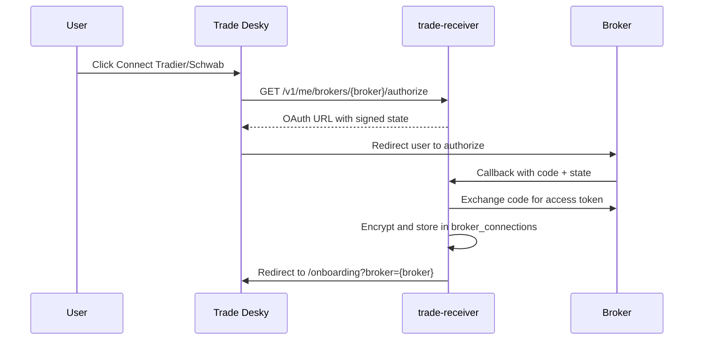

# Trade Receiver

FastAPI alert ingest service with AI trade parsing, Creem subscription gating, and multi-broker execution.

## Quick start

```bash
cd trade-receiver
pip install -e ".[dev]"
uvicorn app.main:app --reload
```

Database defaults to `sqlite:///./data/trade.db` for local dev. For **Turso**, set:

```bash
DATABASE_URL=libsql://your-db-name-org.turso.io
TURSO_AUTH_TOKEN=your-token
```

The app converts `libsql://` to SQLAlchemy's `sqlite+libsql://` form automatically.

## Deploy on Coolify (Dockerfile)

Use the repo **Dockerfile** — do not use Nixpacks.

| Setting | Value |
|---------|--------|
| Service name | **Trade Receiver** |
| Repository | `fcpauldiaz/trade-receiver` |
| Build Pack | **Dockerfile** |
| Dockerfile location | `/Dockerfile` |
| Port | `8000` |
| Start command | leave empty (uses image `CMD`) |

Set production env vars (see `.env.example`). For Turso:

| Variable | Example |
|----------|---------|
| `DATABASE_URL` | `libsql://your-db-org.turso.io` |
| `TURSO_AUTH_TOKEN` | token from `turso db tokens create` |

If you also set `TURSO_SYNC_URL` with a local `sqlite+libsql:///…` `DATABASE_URL`, the app defaults to **remote-only** Turso (avoids libsql embedded-replica Rust panics under concurrent webhook traffic). Set `TURSO_EMBEDDED_REPLICA=true` only if you explicitly need a local replica.

On startup the service logs `database runtime config` with `embedded_replica` and `sync_url_configured` so you can confirm Coolify env (check container logs after deploy). Named SQL placeholders are forced to positional `?` before reaching libsql.

No `/app/data` volume is required for remote Turso **except** desktop installers. Coolify mounts `/app/data/desktop` so Sparkle/WinSparkle assets survive redeploys.

```bash
docker build -t trade-receiver .
docker run --rm -p 8000:8000 -e PORT=8000 -v trade-receiver-data:/app/data trade-receiver
```

## Environment

Copy `.env.example` to `.env`. Variables fall into three groups:

### Server secrets (required in production)

| Variable | Purpose |
|----------|---------|
| `DATABASE_URL` | libSQL/SQLite connection (shared with Trade Desky auth tables) |
| `API_SECRET_KEY` | Signs OAuth state tokens |
| `ENCRYPTION_KEY` | Encrypts per-user broker tokens at rest |
| `RECEIVER_BASE_URL` | Public API URL (ingest + OAuth callbacks) |
| `PLATFORM_BASE_URL` | Where OAuth redirects after connect (e.g. `http://localhost:3000`) |
| `BETTER_AUTH_URL` | Public platform URL — JWT issuer/JWKS for API auth |
| `INTERNAL_API_SECRET` | Shared secret for signup provision + Pro grants |

### Granting Pro

There is no payment-provider checkout. Activate Pro with the internal API:

```bash
curl -s -X POST localhost:8000/v1/internal/subscription/grant \
  -H "X-Internal-Secret: $INTERNAL_API_SECRET" -H "Content-Type: application/json" \
  -d '{"email":"you@example.com","status":"active","plan_name":"pro"}'
```

### OAuth app registration (your developer apps — not user accounts)

Users connect brokers via the platform **Connections** page. These env vars register *your* app with each broker:

| Variable | Broker |
|----------|--------|
| `SCHWAB_CLIENT_ID`, `SCHWAB_CLIENT_SECRET`, `SCHWAB_REDIRECT_URI` | Schwab OAuth app |
| `TRADIER_CLIENT_ID`, `TRADIER_CLIENT_SECRET`, `TRADIER_REDIRECT_URI` | Tradier OAuth app |
| `TRADIER_API_BASE` | Sandbox vs live API host |

Per-user access tokens and account IDs are stored encrypted in `broker_connections` — never in `.env`.

**NinjaTrader** supports two delivery paths:

1. **Device bridge (recommended)** — the Windows receiver opens an outbound WebSocket to Trade Desky. Pair via `POST /v1/me/devices/pair`, then connect to `{ws_url}?token={device_token}`. Orders are pushed to the user's last-seen online device. No ngrok required.
2. **HTTPS forward URL (legacy)** — users paste an HTTPS tunnel URL (`forward_url`) plus an optional `webhook_secret`. Trade Desky cloud POSTs normalized futures JSON to that URL when no device is online.

When a device is online, WSS delivery is tried first; on failure or offline, the service falls back to `forward_url` if configured.

Example normalized futures order payload (same shape for WSS push and HTTP forward):

```json
{
  "id": "uuid",
  "symbol": "MES",
  "action": "BUY",
  "orderType": "MARKET",
  "quantity": 1,
  "stopLossTicks": 10,
  "profitTargetTicks": 20
}
```

### NinjaTrader device bridge protocol

1. `POST /v1/me/devices/pair` — response: `device_id`, `device_token` (shown once), `ws_url` (e.g. `wss://…/v1/devices/ws`; client appends `?token=`).
2. Connect: `WS {ws_url}?token={device_token}` or `Authorization: Bearer {device_token}` on upgrade.
3. Client → server on connect: `{"type":"hello","device_id":"…"}`.
4. Server → client heartbeat: `{"type":"ping"}` every 30s; client replies `{"type":"pong"}`.
5. Server → client order:

```json
{"type": "order", "id": "uuid", "payload": {"symbol": "MES", "action": "BUY", "quantity": 1}}
```

6. Client → server ack within 25s:

```json
{"type": "ack", "id": "uuid", "ok": true}
```

7. `GET /v1/me/devices` — list devices with online status (current user only).
8. `DELETE /v1/me/devices/{id}` — revoke device token.

Delivery uses **last-seen primary**: if multiple devices are online for one user, only the most recently active device receives each order. The in-memory registry requires a single uvicorn worker (current production default).

### Optional

| Variable | Purpose |
|----------|---------|
| `AI_GATEWAY_API_KEY` | Vercel AI Gateway key (preferred for alert parsing + trade filter) |
| `AI_GATEWAY_BASE_URL` | Gateway OpenAI-compatible base (default `https://ai-gateway.vercel.sh/v1`) |
| `AI_MODEL` | Model id, e.g. `openai/gpt-4o-mini` for gateway or `gpt-4o-mini` for direct OpenAI |
| `OPENAI_API_KEY` | Direct OpenAI fallback when gateway key is unset |
| `TURSO_AUTH_TOKEN` | Remote libSQL auth (same value on Trade Desky) |
| `WEBULL_ENABLED` | Feature flag for Webull adapter |

## Broker connect flow


```mermaid
sequenceDiagram
    participant User
    participant Platform as Trade Desky
    participant Receiver as trade-receiver
    participant Broker

    User->>Platform: Click Connect Tradier/Schwab
    Platform->>Receiver: GET /v1/me/brokers/{broker}/authorize
    Receiver-->>Platform: OAuth URL with signed state
    Platform->>Broker: Redirect user to authorize
    Broker->>Receiver: Callback with code + state
    Receiver->>Broker: Exchange code for access token
    Receiver->>Receiver: Encrypt and store in broker_connections
    Receiver->>Platform: Redirect to /onboarding?broker={broker}
```

## API

- `POST /v1/internal/provision` — create/link user from Better Auth signup (internal secret)
- `POST /v1/internal/device-token` — issue desktop API key (internal secret)
- `GET /v1/me` — current user (Better Auth JWT or API key)
- `GET /v1/me/billing` — subscription status
- `POST /v1/internal/subscription/grant` — set Pro/free status (internal secret)
- `GET /v1/me/brokers/tradier/authorize` — start Tradier OAuth
- `GET /v1/me/brokers/schwab/authorize` — start Schwab OAuth
- `GET /v1/reviews` — public customer reviews (newest first)
- `GET /v1/me/review` — current user's review (auth)
- `POST /v1/me/reviews` — create or update review (active subscription required)
- `DELETE /v1/me/reviews` — remove own review (active subscription required)
- `GET /v1/me/settings` — trading prefs including sizing mode
- `PUT /v1/me/settings` — update paper/live, sizing, caps, tickers
- `POST /v1/me/onboarding/complete` — mark onboarding finished
- `POST /v1/me/brokers/{broker}/test-order` — place 1-share SPY test order (follows default_mode)
- `POST /v1/me/brokers/ninjatrader/connect` — store HTTPS forward URL + outbound bridge secret
- `POST /v1/me/devices/pair` — pair NinjaTrader Windows receiver (returns device token + WSS URL)
- `GET /v1/me/devices` — list paired devices and online status (auth)
- `DELETE /v1/me/devices/{id}` — revoke paired device (auth)
- `WS /v1/devices/ws?token=...` — outbound device bridge (user-scoped device token)
- `GET /v1/me/webhooks` — list inbound webhook endpoints (auth)
- `POST /v1/me/webhooks` — create webhook (returns unguessable URL)
- `GET /v1/me/webhooks/{id}` — webhook metadata (auth)
- `DELETE /v1/me/webhooks/{id}` — delete/disable webhook (auth)
- `POST /v1/webhooks/{webhook_id}` — public inbound alert webhook (auth via unguessable URL only); each delivery is recorded in alert audit (`source=webhook`)
- `GET /v1/me/alerts` — user-scoped alert audit (direct ingest and webhook ingest events); includes parsed `payload` JSON for display (webhook bodies capped at 256 KiB UTF-8)
- `POST /v1/ingest` — authenticated alert ingest (desktop app Bearer token)

## Trade sizing

Users choose a sizing mode in settings or onboarding:

| Mode | Behavior |
|------|----------|
| `alert_inferred` | Use contract count from alert text (AI or rules), capped by `max_contracts` |
| `fixed` | Always trade `fixed_contracts` per alert |
| `risk_percent` | Size from account equity × `risk_percent` ÷ option cost, capped by `max_contracts` |

Sizing runs after option chain validation in the ingest pipeline.

## Migrations

Schema migrations run **automatically on app startup** (Alembic `upgrade head`). No manual step is required for deploy or local dev.

To create a new migration after model changes:

```bash
alembic revision --autogenerate -m "describe change"
```

## Tests

```bash
DATABASE_URL=sqlite:///./data/test.db pytest
```

## Related repos

- [trade-desky](https://github.com/fcpauldiaz/trade-desky) — TanStack Start UI (marketing + logged-in app)
- [trade-desky-watcher](https://github.com/fcpauldiaz/trade-desky-watcher) — macOS/Windows desktop alert forwarder
